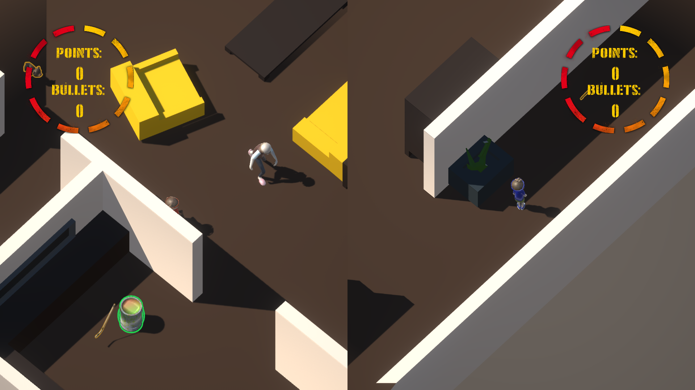
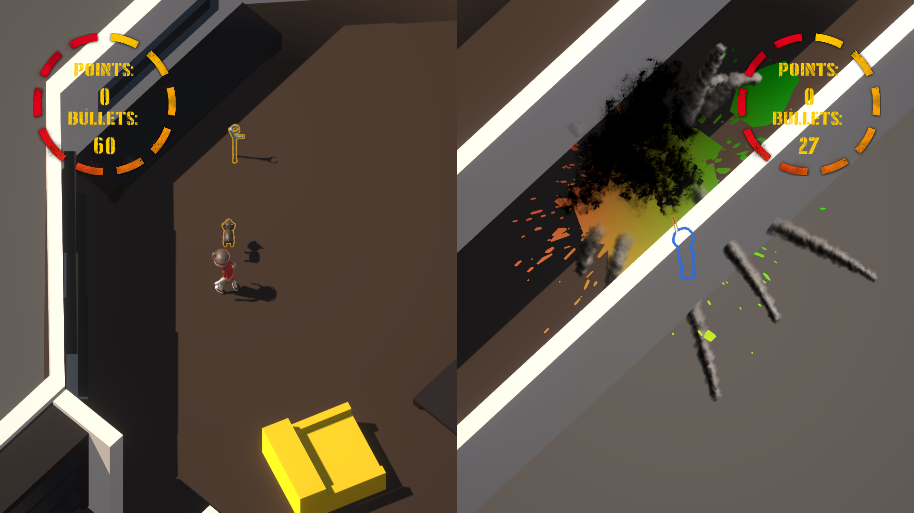

# We Were Kids
3D war game seen by kids imagination. Global Game Jam 6 (2019).
<br/>
<p align="center">
  
  
  
</p>

### Download
All releases of the game are avaliable on the github page in the [releases](https://github.com/msuliborski/we-were-kids/releases) tab. 

## Getting Started
These instructions will get you a copy of the project up and running on your local machine for development and testing purposes. 

### Cloning
```
$ git clone https://github.com/msuliborski/we-were-kids
```

### Building
Using Unity Game Engine import project and hit play button. It should do everything automatically and let you run the game.

## Built with
* [Unity](https://unity.com/) - The world’s leading real-time creation platform

## Authors
* **Michał Suliborski** - [msuliborski](https://github.com/msuliborski)
* **Jędrzej Szor** - [jedrekszor](https://github.com/jedrekszor)
* **Michał Kuśmidrowicz** - [ninjarlz](https://github.com/ninjarlz)
* **Olga Kardas** - [OlgaKar](https://github.com/OlgaKar)
* **Hanna Paluszkiewicz** - [hanka8636](https://github.com/hanka8636)

## License
This project is licensed under the MIT License - see the [LICENSE.md](LICENSE.md) file for details
